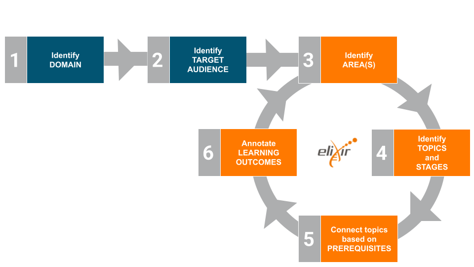

## 1.1 Six-steps Protocol to design Learning Paths

    

!!! "A learning path is a sequence that leads a learner through different learning modules. These modules could be courses or training materials, designed to progressively enhance a learner's thinking skills from basic to advanced levels, ensuring a comprehensive understanding of the subject by the end of the path."

## 1.3 Key Properties of Learning Paths

- **Progressive:** each step builds upon the previous one, gradually increasing in complexity.
- **Directional:** there is a trajectory from the beginning to an end point.
- **Goal-Oriented:** aimed at mastering a subject, adapting to different backgrounds and knowledge levels.

